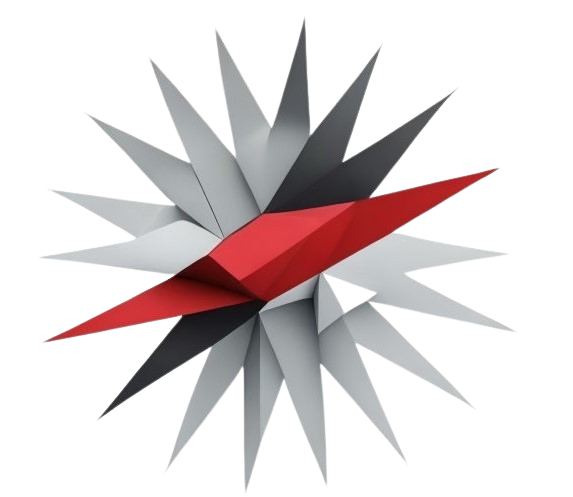

<p align="center">
  <a href="https://fiek.uni-pr.edu/">
    
  </a>

<h3 align="center">UDP Server-Client System</h3>
</p>


## Përmbledhje

Ky projekt implementon një sistem server-klient bazuar në UDP-protokollin ku përdoruesit mund të ndërveprojnë me fajllat në server duke pasur nivele të ndryshme privilegjesh: admin ose viewer. Projekti o i dizajnuar për të trajtuar operacione të thjeshta mbi fajlla (lexo, shkruaj, ekzekuto) bazuar në privilegjet e qasjes së klientit.


## Karakteristikat

- Komunikim me Socket UDP: Serveri dhe klienti komunikojnë përmes protokollit UDP.
- Kontrollimi Bazuar në Privilegje: Klientët kanë privilegje (admin ose viewer) për akses mbi fajlla.
- Operacionet mbi Fajlla: Serveri mund të kryejë veprimet read, write, dhe execute mbi fajllat.
- Shkëputje Automatike për Klientët jo-aktivë: Klientët largohen nga serveri pas një periudhe jo-aktiviteti.
- Verifikimi i Rolit Admin: Vetëm klientët me ADMIN_ID të përcaktuar mund të kenë privilegjet admin.


## Struktura/files e Projektit

- `server.js`: Kodi i serverit.
- `client.js`: Kodi i klientit.
- `kerkesat.log`: Fajlli ku ruhen automatikisht veprimet e klientave ne server.
- `test-files`: Folderi ku ruhen fajllat e testimit.


## Tools/Kerkesat

- Node.js: Sigurohuni që Node.js është instaluar për të ekzekutuar kodin.
- File System: Fajlli example.txt duhet të ekzistojë në dosjen ./test-files.


## Marrja e projektit

### Klononi Repositorin

```sh
git@github.com:EndritKastrati/Projekti2_Rrjeta_Kompjuterike.git
```


### Punuan:
- Endrit Kastrati, Elda Drenica, Elise Gashi, Albin Shabani.

<a href="#top">Shko në fillim ↑</a>


